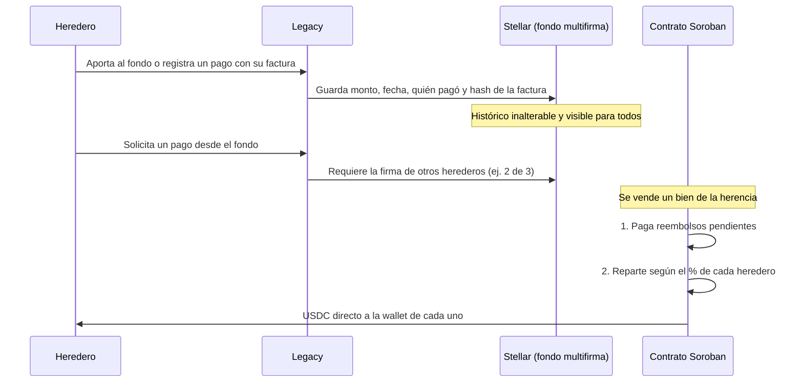
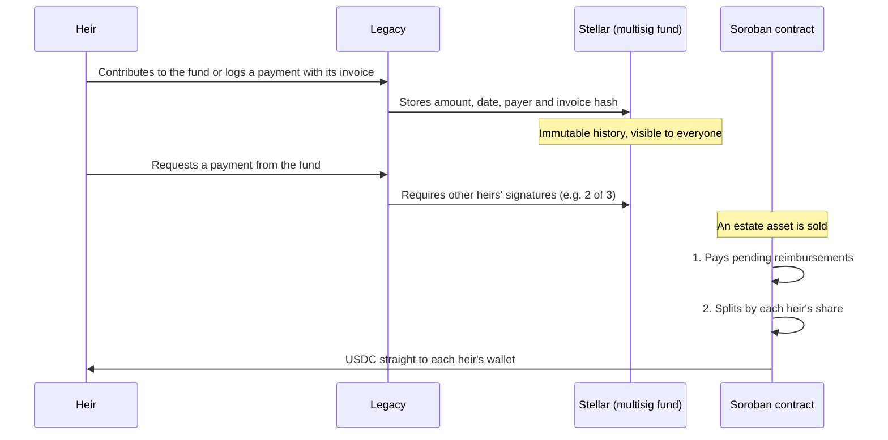

# 🕊️ Legacy

### *Settle the estate, not the arguments.*
### *Liquida la herencia, no las peleas.*

**Un fondo familiar transparente para las sucesiones, construido sobre Stellar**
 
**A transparent family fund for estate settlements, built on Stellar**

---

### 🇨🇴 [Español](#-español) • 🇺🇸 [English](#-english) • 📚 [Entregables](#-entregables--deliverables) • 👥 [Equipo](#-equipo--team)

---

## 🇨🇴 Español

### 🎯 ¿Qué es Legacy?

Cuando muere la persona que sostenía económicamente a una familia, los herederos empiezan a pagar de manera informal los gastos del hogar y de la sucesión: el predial, los servicios, la administración, la notaría, el abogado. Un mes paga la mamá, otro un hijo, otro el otro. Los recibos quedan en fotos del celular, en correos y en papeles sueltos.

Al repartir la herencia nadie sabe con certeza **quién pagó qué, cuánto se gastó ni cuánto se le debe reembolsar a cada uno**. Todo esto pasa en pleno duelo, cuando lo último que una familia quiere es discutir por plata.

**Legacy** propone un fondo familiar sobre **Stellar** donde cada aporte y cada pago queda registrado con su soporte, nadie mueve el dinero solo y, al final, el reparto se hace automáticamente según lo que le corresponde a cada heredero.

> 🧪 **Estado:** Semana 1 del programa *Blockchain Builders 101*. Estamos en la etapa de definición del problema; todavía no hay código.

### 😩 El problema hoy

| Problema | Idea de Legacy |
|----------|----------------|
| 🧾 **Recibos dispersos** en celulares, correos y papeles | Cada pago se registra con la huella digital (hash) de su factura |
| ❓ **Nadie sabe cuánto se ha gastado** ni en qué | Un registro compartido que todos los herederos pueden consultar |
| ⚖️ **Aportes desiguales** que nadie compensa | Los reembolsos pendientes se calculan solos |
| 🔒 **La plata queda en la cuenta de una persona** | Cuenta común con multifirma: nadie retira sin aprobación |
| 🧮 **Conciliación manual** al final de la sucesión | Reparto automático con un contrato Soroban |
| 💔 **Tensiones familiares** en pleno duelo | Un historial neutral que no se puede alterar |

### ⚙️ Cómo funcionaría

### 🔗 ¿Por qué blockchain y no un Excel?

- **Varias partes comparten un registro:** en una herencia, cada peso reconocido a un heredero reduce lo que reciben los demás. El registro no puede depender de uno de ellos.
- **El histórico no se puede alterar:** un pago registrado en marzo no puede borrarse en diciembre, cuando se reparte.
- **Se elimina el intermediario que concentra la confianza:** nadie tiene que custodiar el dinero de los demás.

### 🛠️ Stack previsto

- **Red:** Stellar (Testnet para pruebas)
- **Contratos:** Soroban (Rust)
- **Activo:** USDC, para que el valor no fluctúe
- **Cuenta común:** multifirma nativa de Stellar
- **Privacidad:** en la red solo se guarda el hash de cada factura, nunca el documento

---

## 🇺🇸 English

### 🎯 What is Legacy?

When the person who financially supported a family passes away, the heirs start paying household and estate expenses informally: property tax, utilities, building fees, notary, lawyer. One month the mother pays, the next one of the children, then another. Receipts end up as phone photos, emails and loose papers.

When the estate is finally divided, nobody knows for sure **who paid what, how much was spent, or how much each heir should be reimbursed**. And all of this happens while grieving, when the last thing a family wants is to argue about money.

**Legacy** is a family fund on **Stellar** where every contribution and payment is recorded with its proof, nobody moves the money alone, and at the end the estate is split automatically according to each heir's share.

> 🧪 **Status:** Week 1 of the *Blockchain Builders 101* program. We are defining the problem; there is no code yet.

### 😩 The problem today

| Problem | Legacy's idea |
|---------|---------------|
| 🧾 **Scattered receipts** across phones, emails and papers | Every payment is recorded with the fingerprint (hash) of its invoice |
| ❓ **Nobody knows how much was spent** or on what | A shared record every heir can check |
| ⚖️ **Unequal contributions** nobody compensates | Pending reimbursements are calculated automatically |
| 🔒 **The money sits in one person's account** | Multisig shared account: no withdrawals without approval |
| 🧮 **Manual reconciliation** at the end of the estate process | Automatic distribution through a Soroban contract |
| 💔 **Family tension** during grief | A neutral history that cannot be altered |

### ⚙️ How it would work

### 🔗 Why blockchain and not a spreadsheet?

- **Several parties share one record:** in an inheritance, every peso credited to one heir reduces what the others receive. The record can't belong to any one of them.
- **History can't be altered:** a payment logged in March can't be erased in December, when the estate is split.
- **It removes the intermediary who concentrates trust:** nobody has to hold everyone else's money.

### 🛠️ Planned stack

- **Network:** Stellar (Testnet for testing)
- **Contracts:** Soroban (Rust)
- **Asset:** USDC, so the value doesn't fluctuate
- **Shared account:** Stellar native multisig
- **Privacy:** only each invoice's hash goes on-chain, never the document itself

---

## 📚 Entregables / Deliverables

| Semana / Week | Entregable / Deliverable | Enlace / Link |
|---|---|---|
| 1 | Propuestas individuales / Individual proposals | [`docs/semana1/`](docs/semana1/) |
| 1 | Problem Brief | [`docs/semana1/ProblemBrief.md`](docs/semana1/ProblemBrief.md) |
| 2–5 | _Próximamente / Coming soon_ | [`docs/`](docs/) |

---

## 👥 Equipo / Team

### Santiago Mesa

---

### Juliana Lugo

---

### 💜 Hecho con ❤️ sobre Stellar · Made with ❤️ on Stellar

**Blockchain Acceleration Foundation — Blockchain Builders 101**

